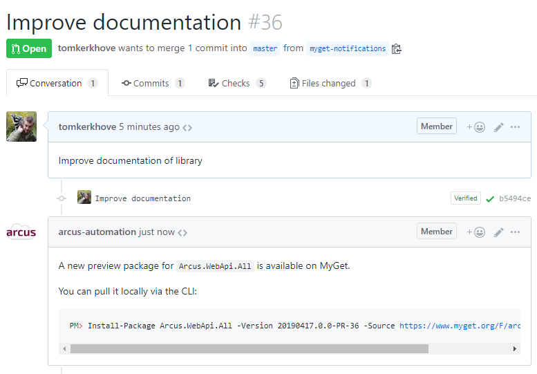
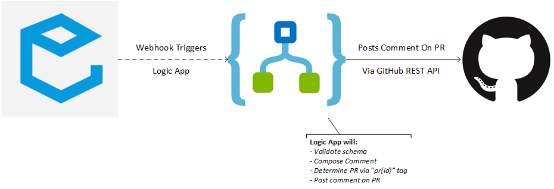

# MyGet Bot for GitHub Pull Requests
A bot to post comments on GitHub pull requests when a new NuGet package is pushed to MyGet.

# Prerequisites
- An Azure subscription
- Access to a MyGet account
- GitHub user that will be used to post comments
- Push NuGet versions in format of `PR-{pr-id}`, but you can also tweak the template to use your pattern

# What does it do?
Our MyGet bot will automatically update your pull requests with guidance on how to consume the published NuGet package.

As of today, it uses package filters to filter out individual packages ending with a given suffix.

# Deployment
1. Deploy the ARM template in `src` or use the "Deploy to Azure" button
2. Create a new webhook registration on your MyGet feed for 'Package Added' events
3. All set!

## How it works
The bot is a simple Azure Logic App which will receive webhook notifications from MyGet when new packages are pushed to your feed.

It will interpret the passed information to compose a comment on the PR that triggered the new packages.

By default the Logic App will determine the PR ID given it assumes to have the `PR-{pr-id}` format.

If your pattern diverts from this pattern you can always tweak the bot and deploy that instead.

# License Information
This is licensed under The MIT License (MIT). Which means that you can use, copy, modify, merge, publish, distribute, sublicense, and/or sell copies of the web application. But you always need to state that Tom Kerkhove is the original author of this web application.
